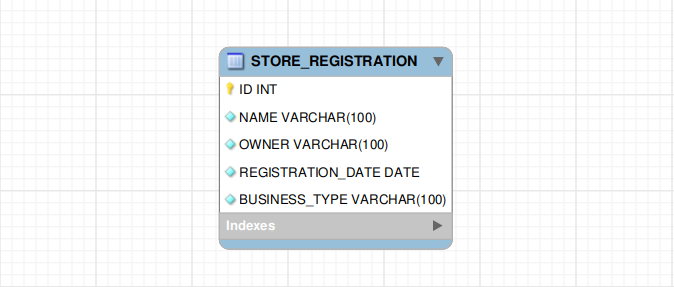

## :file_folder: Estrutura da tabela

- ### Update
PUT /store-registration/:id 
Body:
name | owner | registrationDate | businessType
--- | --- | --- | ---
String | String | String | String

- ### Select by owner
GET /store-registration/owner 
Query params:
name | page | limit
--- | --- | ---
String | Integer | Integer

Exemplo: /store-registration/owner?name=microsoft&page=0&limit=3 

- ### Select by business type
GET /store-registration/business 
Query params:
type | page | limit
--- | --- | ---
String | Integer | Integer

Exemplo: /store-registration/business?type=sales&page=0&limit=3 

<b>Obs: Caso o paramentro "page" não seja informado o padrão é 0</b>

